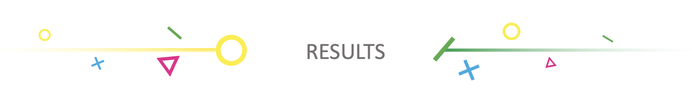

# <Your-Project-Title>

## 
  

 
The techniques chosen for the analysis are described below. They are classified into the different security and privacy tests performed:
 
 
<ul>
  <li><strong>Installation</strong>: there were no techniques found in this phase.</li>
   
  <li><strong>Interaction</strong>:</li>
  <ul>
    <li><i>SPA</i>: voice commands are the main interaction with the device. “Audio Capture” gathers the different techniques attackers may use in order to obtain sensitive information by the audio interaction with the SPA. The images show that it is not a usual technique among the selected groups.</li>
    <li><i>Third-party skills</i>: adversaries may try to steal data from the user with phishing techniques. "MITRE" defines this behaviour as “Phishing”. The results below show that attackers usually employ these techniques and are poorly detected.</li>
  </ul>
   
  <li><strong>Functionality</strong>: this section covers tests related to payments functionalities and the possibility of creating safe profiles for minors:</li>
  <ul>
    <li>Minors: they can be fooled with the same phishing techniques explained previously.</li>
    <li>Payments: several techniques related to this topic were selected.</li>
    <ul>
      <li><i>Data from local system</i> is a technique often used by attackers where they may obtain payment data stored in the local system of the device. Moreover, results show that while there is good visibility coverage, detection results are worse.</li>
      <li><i>External remote services</i>: in this technique, attackers obtain personal information from the users by accessing related remote services. It was found that one of the groups selected has already compromised several online payment services, which could affect the payment service in the SPA. The matrixes show poor visibility and detection results while being a usual technique.</li>
    </ul>
  </ul>
   
  <li><strong>Privacy and security</strong>: in this category two techniques were chosen. Regarding the personal information answers and conversation history, “Data from cloud storage object” is selected again. Going on to the authentication methods, if the user accesses the device via the web, he could be affected by the “Steal web session cookie” technique obtaining its access credentials. However, results show that it is not often used by the selected groups.</li>
</ul>
  

(<a href="https://soniasoleracotanilla.github.io/Tests/">Back Testing</a>)

## 
  

In summary, four frequently used techniques are remarked. “Phishing for information: spearphishing service”, “Data from local system” and “Data from cloud storage object” show good visibility coverage but poor detection coverage. 

The remaining one, “External remote services”, shows both poor visibility and detection coverage.

(<a href="https://soniasoleracotanilla.github.io/Tests/">Back Testing</a>)

